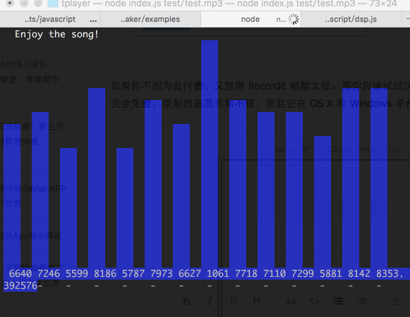

# A terminal music player with audio spectrum

## Usage:

1. `npm install -g tplayer`
2. `tplayer dir_to_your.mp3`

## Environment

For now tplayer only works with `node v4.4.4`. It is not working on `v6.x.x`, because of [an issue of node-lame](https://github.com/TooTallNate/node-lame/issues/62)

## refs:

* [stream handbook](https://github.com/substack/stream-handbook)
* [Write transform stream](http://codewinds.com/blog/2013-08-20-nodejs-transform-streams.html)
* [FFT audio](https://developer.mozilla.org/en-US/docs/Visualizing_Audio_Spectrum)
* [Spectral density](https://en.wikipedia.org/wiki/Spectral_density#Explanation)

## dependencies

- [blessed-contrib](https://github.com/yaronn/blessed-contrib): console chart lib
- [node-speaker](https://github.com/TooTallNate/node-speaker): play pcm stream
- [node-lame](https://github.com/TooTallNate/node-lame): mp3 stream to pcm stream

## plans

- [ ] The default stream chunk size is a little big, this makes the bars updating a little slow. According to [the stream doc](https://nodejs.org/api/stream.html#stream_readable_read_size_1), one can make his own read stream with certan size.

## License

MIT
